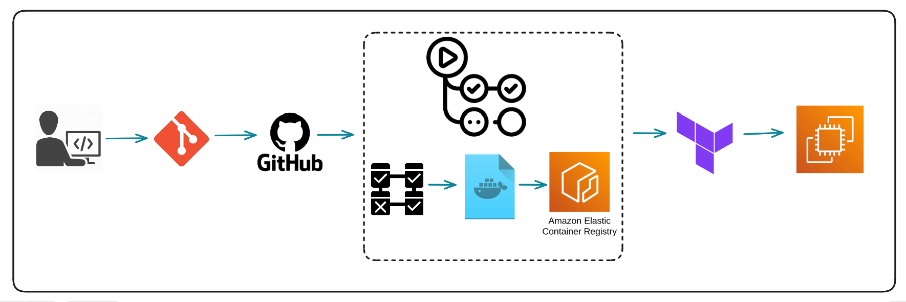

# CI/CD for Python Web Application

This repository contains the configuration files and scripts for implementing Continuous Integration (CI) and Continuous Deployment (CD) for the Python Web Application using GitHub Actions.

## CI/CD Workflows

### Python Testing Application Workflow

- **File**: [`.github/workflows/test-and-lint.yaml`](.github/workflows/test-and-lint.yaml)
- **Trigger**: This workflow is triggered whenever a pull request is created or updated on the `main` branch.

#### Workflow Description

This workflow is responsible for testing the Python-based Python Web Application. It performs the following steps:
- Sets up the Python environment based on the specified Python versions.
- Installs project dependencies, including Flask, pytest, and flake8.
- Lints the codebase using flake8 to check for syntax errors and coding standards.
- Executes unit tests using pytest.

### Build Docker Image and Upload to ECR Workflow

- **File**: [`.github/workflows/docker-ecr-ci.yaml`](.github/workflows/docker-ecr-ci.yaml)
- **Trigger**: This workflow is triggered in the following scenarios:
  - When a pull request is created or updated on the `main` branch.
  - After the "Python Testing Application" workflow completes successfully.
  - Manually triggered using the GitHub Actions workflow dispatch.

#### Workflow Description

This workflow automates the containerization and ECR (Amazon Elastic Container Registry) image management for the Python Web Application. It consists of the following steps:
- Checks for the result of the "Python Testing Application" workflow. If it fails, it provides a failure message.
- Configures AWS credentials for ECR access.
- Logs in to Amazon ECR.
- Deletes existing images from the ECR repository.
- Builds a Docker image and pushes it to the ECR repository.

### Deploy to EC2 Workflow

- **File**: [`.github/workflows/deploy.yaml`](.github/workflows/deploy.yaml)
- **Trigger**: This workflow is triggered in the following scenarios:
  - When a pull request is created or updated on the `main` branch.
  - After the "Build Docker Image and Upload to ECR" workflow completes successfully.
  - Manually triggered using the GitHub Actions workflow dispatch.

#### Workflow Description

This workflow automates the deployment of the Python Web Application to an EC2 instance using Terraform. It includes the following steps:
- Checks for the result of the "Build Docker Image and Upload to ECR" workflow. If it fails, it provides a failure message.
- Sets up Terraform for infrastructure management.
- Initializes Terraform and performs a plan to review changes.
- Applies Terraform changes to deploy the application to EC2.

## Usage

To use these CI/CD workflows for your Python Web Application, follow these steps:

1. Fork this repository to your own GitHub account.

2. Configure the necessary secrets and environment variables in your repository settings, including AWS credentials for ECR and EC2 deployment.

3. Create and manage pull requests on the `main` branch to trigger the workflows automatically.

4. Monitor the workflow runs and review their logs for any issues.

For more details on each workflow's functionality and configuration, refer to the respective workflow files.

## Notes

- This is a simplified example for educational purposes.
- Ensure proper security group settings to allow traffic on the required ports.
- Remember to clean up resources when they are no longer needed.
