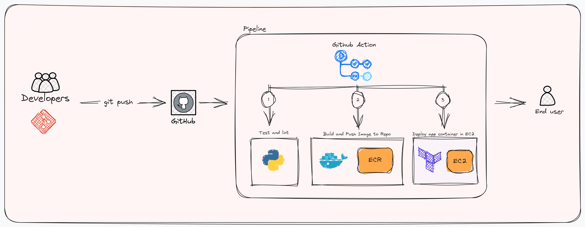

# CI/CD for Python Web Application

This repository contains configuration files and scripts to implement Continuous Integration (CI) and Continuous Deployment (CD) for a Python Web Application using GitHub Actions.

## CI/CD Workflows

### 1. Python Testing Application Workflow

- **File**: [`.github/workflows/test-and-lint.yaml`](.github/workflows/test-and-lint.yaml)
- **Trigger**: Triggered on pull requests to the `main` branch.

**Workflow Description:**
This workflow tests the Python Web Application by:
- Setting up the Python environment.
- Installing dependencies (Flask, pytest, flake8).
- Linting the codebase using flake8.
- Executing unit tests with pytest.

### 2. Build Docker Image and Upload to ECR Workflow

- **File**: [`.github/workflows/docker-ecr-ci.yaml`](.github/workflows/docker-ecr-ci.yaml)
- **Trigger**: Triggered on push to the `main` branch, successful completion of "Python Testing Application" workflow, or manual trigger.

**Workflow Description:**
Automates containerization and ECR (Amazon Elastic Container Registry) image management for the Python Web Application:
- Checks the result of the "Python Testing Application" workflow and provides a failure message if it fails.
- Configures AWS credentials for ECR access.
- Logs in to Amazon ECR.
- Deletes existing images from the ECR repository.
- Builds a Docker image and pushes it to the ECR repository.

### 3. Deploy to EC2 Workflow

- **File**: [`.github/workflows/deploy.yaml`](.github/workflows/deploy.yaml)
- **Trigger**: Triggered on push to the `main` branch, successful completion of "Build Docker Image and Upload to ECR" workflow, or manual trigger.

**Workflow Description:**
Automates deployment of the Python Web Application to an EC2 instance using Terraform:
- Checks the result of the "Build Docker Image and Upload to ECR" workflow and provides a failure message if it fails.
- Sets up Terraform for infrastructure management.
- Initializes Terraform and performs a plan to review changes.
- Applies Terraform changes to deploy the application to EC2.

## Usage

To use these CI/CD workflows for your Python Web Application, follow these steps:

1. Fork this repository to your GitHub account.

2. Configure necessary secrets and environment variables in your repository settings, including AWS credentials for ECR and EC2 deployment.

3. Create and manage pull requests on the `main` branch to trigger the workflows automatically.

4. Monitor workflow runs and review logs for any issues.

For detailed information on each workflow's functionality and configuration, refer to the respective workflow files.

## Note

- Remember to clean up resources when they are no longer needed.
